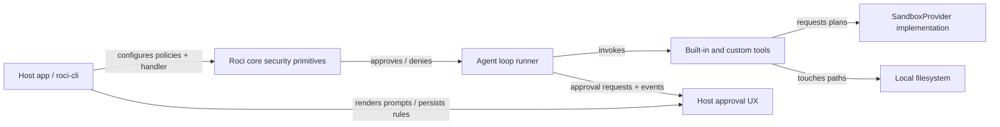
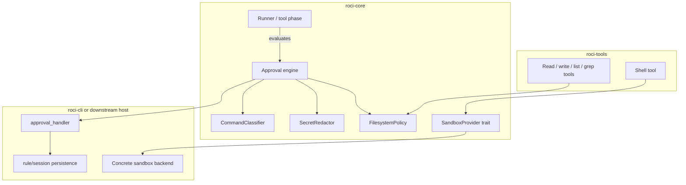
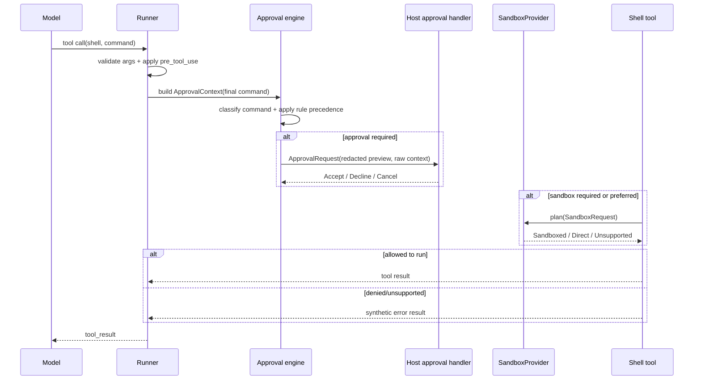
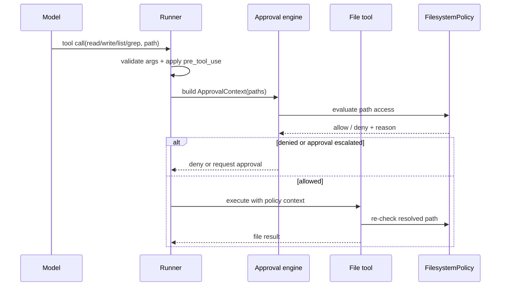

# G2: SDK security primitives

## Executive summary
Roci already has the right insertion points for SDK security work — `RunRequest.approval_policy`, `approval_handler`, `pre_tool_use` / `post_tool_use`, the runner tool phase, and built-in shell/file tools — but the current implementation is intentionally thin. `ApprovalPolicy` is still a three-state enum, approval classification is a tool-name switch, built-in tools execute directly, and `roci-cli` only demonstrates hooks rather than owning a durable permission model.

New product guidance changes the design bias: **Roci has no external SDK users yet, and breaking changes are acceptable if they improve the long-term SDK shape.** That means G2 should prefer the cleanest reusable contracts over compatibility shims.

Prior art converges on the same split:
- **Codex** separates reusable exec policy, command safety classification, filesystem sandbox policy, and sandbox planning from CLI/UI transport.
- **Claude Code** separates permission types/rule precedence/classifiers from UI queues and prompt/dialog rendering, and keeps non-bypass safety floors for dangerous commands.
- **Pi** exposes extension hooks/tool overrides as SDK enforcement points while interactive/RPC modes own prompts and user experience.

Recommendation: ship **platform-neutral security primitives in `roci-core`**, enforce them in the runner + `roci-tools`, and leave **permission UX, persistence, and concrete OS sandbox implementations** to apps such as `roci-cli` or downstream hosts.

## Planning assumptions
- No external SDK consumers need source compatibility yet.
- Breaking API changes are acceptable and preferred when they remove transitional layers.
- Convenience constructors are fine, but avoid dual APIs that preserve the old enum model.
- `roci-cli` is a host/example app, not the place to define reusable security semantics.

## Threat model
- Prompt injection or model mistakes trigger destructive shell commands, privilege escalation, or writes outside the intended workspace.
- Tool arguments/results leak secrets through approval payloads, run events, logs, or previews.
- Policy is bypassed via shell wrappers, leading env vars, relative paths, symlinks, or `pre_tool_use` arg rewriting.
- A requested sandbox is unavailable and execution silently falls back to unsandboxed local execution.
- Retries or repeated tool calls produce duplicate approvals or inconsistent policy decisions.

## SDK boundary
### Roci should ship
- Pure security types and evaluation logic in `roci-core`.
- Default command classification heuristics and redaction patterns.
- Path normalization + filesystem policy evaluation helpers.
- `SandboxProvider` request/plan abstraction only.
- Runner integration points that evaluate policy after tool args are finalized and before tool execution.
- Built-in file/shell tool enforcement hooks that consume these primitives.

### Apps like `roci-cli` should own
- Dialogs, TUI/GUI prompts, remote approval transport, and "always allow" UX.
- Policy persistence across sessions/accounts/projects.
- Concrete sandbox implementations (Seatbelt, bwrap, containers, etc.).
- Product-specific defaults such as plan mode, trust modes, or org-managed rules.

### Non-goals
- UI dialogs or permission component design.
- Platform-specific sandbox implementations.
- Secret storage/key management.
- Replacing host-owned policy persistence.
- Full shell parsing or perfect command understanding.
- Preserving the current enum-based approval API if it conflicts with the cleaner model.

## ADR: Put security primitives in `roci-core`, enforcement in runner + builtins
### Status: Proposed
### Context
Security decisions must be reusable by multiple hosts, but the current host (`roci-cli`) should not become the only place where approvals/filesystem checks live. At the same time, concrete sandboxing and approval UX are app-specific.
### Options:
1. App-only hooks — minimal SDK changes / duplicated logic and weak guarantees.
2. `roci-core` primitives + runner/tool enforcement + app-owned UX — reusable / moderate integration work.
3. Ship concrete sandboxes + UI in SDK — strongest defaults / too much ops and product coupling.
### Decision: option 2
### Consequences:
- Makes easier: shared correctness across hosts, future CLI parity, testable rule logic.
- Makes harder: runner and tool APIs gain explicit security plumbing.
- Revisit if: roci becomes CLI-only rather than SDK-first.

## ADR: Replace the flat `ApprovalPolicy` enum with a structured ruleset
### Status: Proposed
### Context
Current `ApprovalPolicy::{Never,Ask,Always}` is too coarse. The runner maps tool names to coarse kinds before execution, so it cannot express command/path-specific policy or non-bypass danger floors. Because Roci has no external SDK consumers yet, preserving the current enum as a first-class API adds unnecessary drag.
### Options:
1. Keep enum and add more tool-name cases — low churn / still too coarse.
2. Keep enum as public API, add adapter to hidden ruleset — gentler migration / carries long-lived conceptual debt.
3. Replace enum-centric API with structured ruleset and optional preset constructors — breaking change / clean long-term model.
### Decision: option 3
### Consequences:
- Makes easier: per-tool, per-command, per-path, and per-category approvals with one canonical model.
- Makes harder: current examples/tests/config wiring must be updated together.
- Revisit if: real external SDK adopters appear before G2 lands.

## ADR: Use heuristic command classification as a safety floor, not a security boundary
### Status: Proposed
### Context
Roci’s built-in shell tool currently accepts a raw shell string. Full shell parsing is expensive and brittle; naive regex-only detection is easy to bypass.
### Options:
1. Regex-only dangerous list — fast / fragile.
2. Full shell parser — precise / high complexity and shell-specific drift.
3. Normalized heuristic classifier trait with default implementation — pragmatic / imperfect but extensible.
### Decision: option 3
### Consequences:
- Makes easier: host overrides, testing, and Codex/Claude-inspired defaults.
- Makes harder: some false positives/unknowns remain.
- Revisit if: Roci gains a first-class argv-based exec tool.

## ADR: Make redaction opt-in for model context, default-on for previews/logging helpers
### Status: Proposed
### Context
Secret redaction is necessary for approval/event/logging surfaces, but automatically mutating model-visible tool results can change behavior and break workflows.
### Options:
1. Always redact tool results before they re-enter context — safest / behavior-breaking.
2. Utility only, no integration — flexible / easy to forget.
3. Utility + helper integration for approval/event previews, with model-context redaction opt-in — balanced / slightly more plumbing.
### Decision: option 3
### Consequences:
- Makes easier: safe logging and approval rendering without surprising tool semantics.
- Makes harder: hosts must explicitly opt into model-context redaction.
- Revisit if: telemetry/persistence become first-class SDK features.

## ADR: Keep `SandboxProvider` as a plan/transform abstraction only
### Status: Proposed
### Context
Roci needs a reusable sandbox boundary for shell/tool execution, but concrete platform sandboxes are out of scope for G2 and expensive to maintain.
### Options:
1. No sandbox abstraction yet — simplest / shells stay host-specific and hard to secure.
2. Trait returning sandbox plan/requirements only — reusable / hosts still implement executors.
3. Ship concrete macOS/Linux implementations in G2 — stronger defaults / out of scope and operationally heavy.
### Decision: option 2
### Consequences:
- Makes easier: future `roci-cli` integration and downstream custom backends.
- Makes harder: no immediate isolation win without host work.
- Revisit if: a single sandbox backend becomes standard across hosts.

## Recommended contracts
### Approval rules
- Replace the enum-centric `ApprovalPolicy` API with a canonical structured policy model.
- `ApprovalEffect`: `Allow`, `Ask`, `Deny`.
- `ApprovalScope`: `Once`, `Session`, `PersistentHint` (hint only; persistence stays host-owned).
- `ApprovalRule`: `id`, `matcher`, `effect`, `reason`, `source`, `bypassable`.
- `ApprovalMatcher`: matches on tool name/kind, command categories, executable prefix, filesystem access class, sandbox requirement.
- `ApprovalEvaluation`: final effect, matched rules, safety floor, optional suggested rule amendment.
- `ApprovalContext`: finalized tool invocation plus optional `CommandInsight`, `FilesystemAccessSummary`, and `SandboxRequirement`.
- Optional convenience presets may exist (`ask_all()`, `deny_all()`, etc.), but they should compile directly to the structured ruleset rather than preserve the old enum surface.

### Command classifier
- `CommandClassifier` trait: classify a normalized command request.
- `CommandInput`: raw command, optional cwd, tool name, optional shell kind/platform.
- `CommandInsight`: normalized command text, primary executable, matched categories, reasons, confidence.
- Default categories to ship: `ReadOnly`, `WritesFilesystem`, `DestructiveDelete`, `PrivilegeEscalation`, `PermissionChange`, `ProcessControl`, `NetworkLikely`, `CodeExecution`, `Unknown`.

### Secret redaction
- `SecretRedactor` utility with `scan_text`, `redact_text`, and `redact_json` helpers.
- `SecretMatch`: `kind`, byte range/path, replacement token.
- Default replacements should preserve structure (`[REDACTED_API_KEY]`, `[REDACTED_TOKEN]`) for logs/previews.

### Filesystem policy
- `FilesystemPolicy`: readable roots, writable roots, denied paths/globs, path resolution mode, symlink policy. Default should be permissive until a host configures restrictions.
- `PathAccessRequest`: operation (`Read`, `Write`, `Create`, `Delete`, `List`, `Search`) + path.
- `FilesystemDecision`: allow/deny + matched boundary/reason.
- Pure evaluation object only; no direct OS sandboxing in this type.

### Sandbox provider
- `SandboxProvider` trait with `plan(SandboxRequest) -> SandboxPlan`.
- `SandboxRequest`: command input, cwd, environment hints, `FilesystemPolicy`, optional network/isolation requirement, command insight.
- `SandboxPlan`: `NotRequired`, `Direct`, `Sandboxed { .. }`, `Unsupported { reason }`.
- Hosts decide how to execute a returned plan.

## Approval precedence model
1. Validate tool args and apply `pre_tool_use` rewriting/blocking.
2. Build `ApprovalContext` from the **finalized** invocation.
3. Derive facts: tool kind, command insight, filesystem decisions, sandbox availability/requirement.
4. Apply hard denies first (denied path, forbidden tool kind, unsupported required sandbox).
5. Evaluate matching rules; strongest effect wins with precedence `Deny > Ask > Allow`.
6. Break same-effect ties by specificity: exact path/command > executable prefix > category > tool kind > default preset.
7. Apply non-bypass safety floors from the classifier/policy (e.g. destructive delete / privilege escalation cannot be silently allowed by a broad allow rule).
8. Emit approval requests with redacted previews and optional suggested session/persistent amendment hints.
9. Keep session/persistent storage outside the core policy evaluator.

## Integration points
- **Runner control/tool phase**: replace tool-name-only approval classification with policy evaluation on finalized invocations.
- **`execute_tool_call` plumbing**: security evaluation happens after arg rewriting and before actual tool execution.
- **Built-in shell tool**: classify command, request sandbox plan when configured, fail closed or require approval when isolation is required but unavailable.
- **Built-in file/list/grep tools**: resolve and evaluate all target paths with `FilesystemPolicy` before touching disk.
- **Run/agent events**: expose security decision metadata and use `SecretRedactor` helpers for approval/event previews.
- **Host apps**: continue to own `approval_handler`, policy persistence, prompt UX, and sandbox-provider registration.

## Acceptance criteria
- The public approval API is simplified around one canonical structured ruleset, without long-lived compatibility shims.
- Approval decisions can depend on tool kind, command classification, filesystem scope, and sandbox availability.
- Shell + file built-ins have deterministic policy enforcement hooks, not just prompt/UI hooks.
- `SecretRedactor` covers both text and JSON payloads with regression fixtures, and default integration only redacts approval/log/event previews.
- `SandboxProvider` lands as an abstraction only; no platform sandbox implementation is required for G2.
- Tests cover precedence, dangerous-command floors, symlink/path normalization, redaction stability, and sandbox-unavailable behavior.

## Open questions
1. Decision: built-in file access stays permissive until a host configures `FilesystemPolicy` restrictions.
2. Decision: redact approval/log/event previews only by default; model-visible tool results remain unchanged unless explicitly enabled.
3. Open question: is an SDK-provided in-memory session-approval helper still worthwhile, or should all session persistence remain host-owned?
4. Open question: is network policy part of `SandboxRequest` v1, or explicitly deferred to a future `NetworkPolicy` primitive?

## Parallel workstreams
- **Independent first**: `.2` CommandClassifier, `.3` SecretRedactor, `.4` FilesystemPolicy.
- **Integration next**: `.1` ApprovalPolicy engine once classifier/filesystem contracts are stable.
- **Final abstraction**: `.5` SandboxProvider after filesystem and approval contracts settle.
- **Critical path**: `.2.1` + `.4.1` -> `.1.1` -> `.1.2` -> `.5.2`.

## Risk notes
- Biggest correctness risk: evaluating approval before args are rewritten or canonicalized.
- Biggest product risk: silently unsandboxed execution when a host expects isolation.
- Biggest compatibility risk: partial migration where old enum-style paths and new ruleset paths both exist.
- Biggest false-positive risk: dangerous-command heuristics that are too broad for harmless read-only workflows.

## Mermaid diagrams
### C4 Context — Roci SDK security boundary

### C4 Container — Proposed internal boundaries

### Sequence — shell execution with approval + sandbox planning

### Sequence — file tool access with filesystem policy

