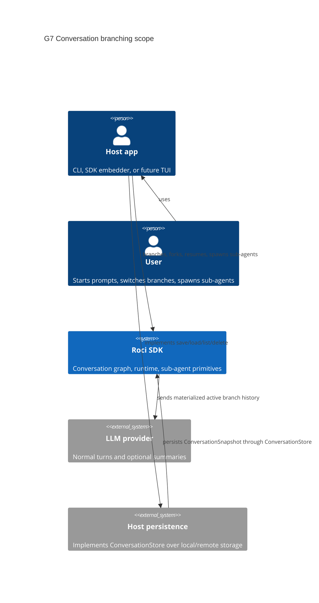
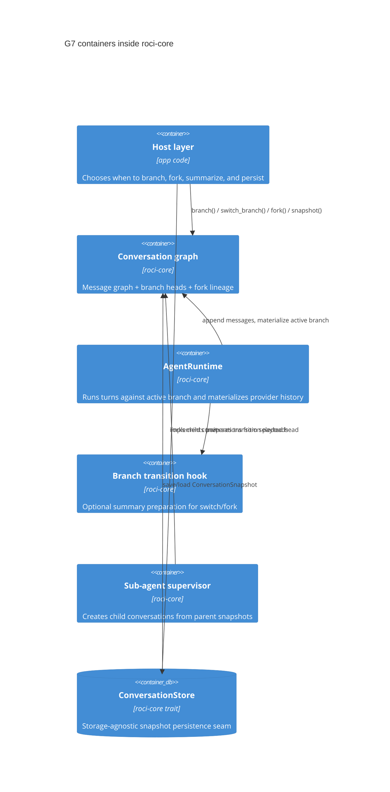
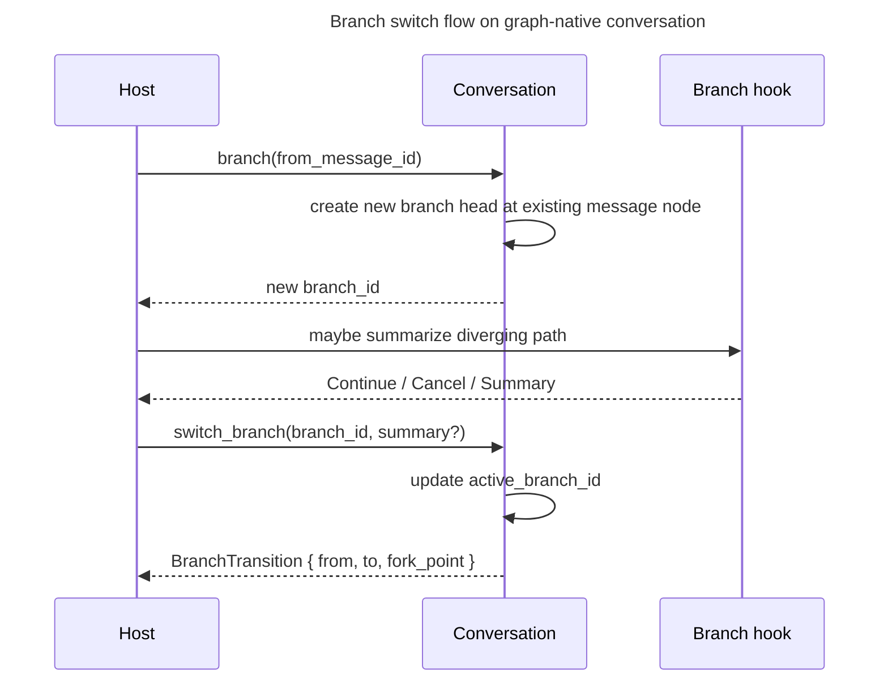
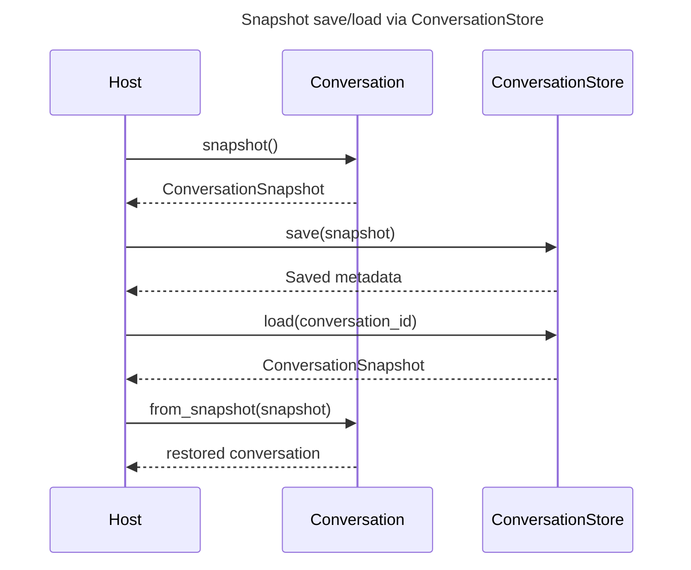
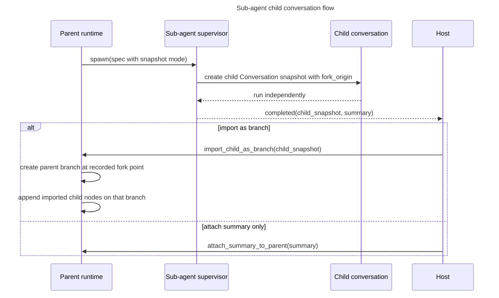

# G7: Conversation branching / fork support (SDK)

## Goal
Design branch-native conversation primitives for `roci-core` so hosts can fork, switch, snapshot, and resume conversations cleanly. Optimize for the right long-term SDK shape rather than preserving the current flat conversation internals.

## Scope
- graph-native conversation/message identity model (`MessageId`, parent refs, branch heads, fork origin)
- `Conversation::branch()` / `switch_branch()` / `fork()` semantics
- snapshot / resume contracts for conversations and branches
- `ConversationStore` trait in core v1
- summary hooks around branch transitions where appropriate
- sub-agent child conversation lineage + import semantics
- simple linear happy path built on top of the branch model

## Non-goals
- no CLI or TUI workflow design in this epic
- no required JSONL / SQLite / file persistence format in core
- no branch merge / rebase support in v1
- no automatic AI summary generation unless a host opts in
- no attempt to preserve the current flat `Conversation` storage shape for compatibility reasons

## Assumptions
- Roci is in active development; there are no external SDK users yet.
- Breaking changes are acceptable and preferred when they produce a cleaner long-term SDK.
- Default single-branch usage must still be ergonomic, but it should sit on top of the branch-native core model.

## ADR: Branch state model
### Status: Proposed
### Context: The current `Conversation` and `AgentRuntime` store a flat `Vec<ModelMessage>`, but branching needs first-class lineage, branch heads, and cheap forks.
### Options:
1. Keep per-branch copied `Vec<ModelMessage>` lists — simpler transition from current code / bakes linear storage into the core model and duplicates ancestry aggressively.
2. Use a graph-native conversation model: messages are nodes keyed by `MessageId`, branches are named heads, and provider-facing linear histories are materialized from a chosen branch head — clean long-term model, cheap branch creation / requires a real rewrite.
3. Avoid in-process branches and only support standalone `fork()` conversations — simpler implementation / poor switch-in-place story and weak sub-agent lineage.
### Decision: Option 2.
### Consequences:
- Makes easier: true lineage, cheap branch creation, explicit branch heads, and durable snapshot semantics.
- Makes harder: current flat runtime/conversation internals must be replaced rather than patched.
- Revisit if: branch-native traversal proves too complex for the rest of the SDK surface.

## ADR: Message model boundary
### Status: Proposed
### Context: Branch-aware metadata is SDK state, while `ModelMessage` is the provider-facing transport payload.
### Options:
1. Add `message_id`/`parent_id` directly to `ModelMessage` — convenient / mixes SDK graph metadata into transport types.
2. Introduce a branch-aware envelope (e.g. `ConversationMessage` or `MessageNode`) that contains `id`, `parent_id`, branch metadata, and a `ModelMessage` payload — clear layering, transport stays clean / larger API shift.
3. Keep metadata hidden entirely inside `Conversation` internals — smallest public API / weak snapshot and host integration story.
### Decision: Option 2.
### Consequences:
- Makes easier: a clean separation between provider payloads and SDK graph state.
- Makes harder: existing APIs returning raw `&[ModelMessage]` need to be redesigned.
- Revisit if: hosts strongly prefer direct identity on transport messages.

## ADR: Branch vs fork semantics
### Status: Proposed
### Context: Pi supports in-session tree navigation, Codex separates resume from fork, and Claude isolates child forks.
### Options:
1. `branch()` and `fork()` are synonyms — small API / loses important lineage distinctions.
2. `branch()` creates a new branch head within the same `Conversation`; `fork()` creates a new `Conversation` with a new `ConversationId` and `fork_origin` — explicit and composable / slightly larger API.
3. Only expose `fork()`; hosts emulate branches — pushes too much policy into every host.
### Decision: Option 2.
### Consequences:
- Makes easier: switch-in-place and exported-fork use cases are both explicit.
- Makes harder: the SDK must define both branch-head and conversation-lineage metadata.
- Revisit if: hosts converge on a single fork-only workflow.

## ADR: Runtime integration
### Status: Proposed
### Context: `AgentRuntime` currently owns a flat `Vec<ModelMessage>` and raw `replace_messages()` mutation.
### Options:
1. Keep runtime flat and adapt the graph only at API edges — smaller change / preserves the wrong center of gravity.
2. Make `AgentRuntime` own a branch-native `Conversation` directly and materialize branch histories when talking to providers — cleanest model / larger rewrite.
3. Keep branching entirely outside runtime — weak resume/snapshot/hook integration.
### Decision: Option 2.
### Consequences:
- Makes easier: one source of truth for branching, summaries, snapshots, and sub-agent lineage.
- Makes harder: runtime watchers/snapshots and tests must be reworked.
- Revisit if: runtime performance regresses from repeated materialization.

## ADR: Persistence boundary
### Status: Proposed
### Context: resume/fork hooks matter, but the SDK must remain storage-agnostic while still offering a first-class core persistence contract.
### Options:
1. Hardcode a built-in store format in `roci-core` — convenient / over-couples SDK to one host workflow.
2. Define serializable snapshot DTOs and a `ConversationStore` trait in core v1 — host-owned durability, shared semantics, explicit load/save boundary / requires trait design work now.
3. Leave persistence entirely undefined — no common resume contract.
### Decision: Option 2.
### Consequences:
- Makes easier: common snapshot semantics and a standard persistence seam without locking into JSONL or SQLite.
- Makes harder: the core API must define store responsibilities, errors, and lifecycle clearly.
- Revisit if: first-party hosts later need multiple specialized store traits instead of one general contract.

## ADR: Sub-agent interaction model
### Status: Proposed
### Context: sub-agents already receive snapshots, but they are not yet represented as child conversations with lineage.
### Options:
1. Treat sub-agents as ordinary branches inside the parent conversation — browseable / breaks isolation and blurs ownership.
2. Give each sub-agent its own `Conversation` with `fork_origin` pointing to the parent branch head; parent import is explicit (`none`, `attach_summary_to_parent`, `import_child_as_branch`) — clean isolation and lineage / more explicit APIs.
3. Keep sub-agents outside the branching model — lowest effort / weak lineage and resume semantics.
### Decision: Option 2.
### Consequences:
- Makes easier: isolated child execution, resumability, and explicit import policy.
- Makes harder: hosts must choose an import policy intentionally.
- Revisit if: a future peer-bus design wants live parent-child mutation.

## Recommended data model

### Core identifiers
- `ConversationId`: opaque UUIDv7-style identifier for a conversation container
- `BranchId`: opaque UUIDv7-style identifier for a named branch head inside a conversation
- `MessageId`: opaque UUIDv7-style identifier for one graph node

### Core graph types
`ConversationMessage` / `MessageNode`:
- `message_id: MessageId`
- `parent_id: Option<MessageId>`
- `payload: ModelMessage`
- optional metadata bag for host/runtime annotations

`BranchHead`:
- `branch_id: BranchId`
- `head_message_id: Option<MessageId>`
- `forked_from_branch_id: Option<BranchId>`
- `forked_from_message_id: Option<MessageId>`
- `label: Option<String>`
- `summary: Option<BranchSummaryRef>`
- `origin: user | subagent | imported`

`Conversation`:
- `conversation_id: ConversationId`
- `active_branch_id: BranchId`
- `messages: HashMap<MessageId, ConversationMessage>`
- `branches: HashMap<BranchId, BranchHead>`
- `fork_origin: Option<ForkOrigin>`

`ForkOrigin`:
- `parent_conversation_id`
- `parent_branch_id`
- `parent_message_id`
- `reason: user_fork | subagent_spawn | imported_snapshot`

### Materialization rules
- The branch graph is the source of truth.
- Provider-facing linear history is produced by walking `parent_id` from a branch head back to root, then reversing.
- Appending to the active branch creates a new message node whose `parent_id` is the prior active head, then advances that branch head.
- Creating a branch is metadata-only: create a new branch head pointing at an existing `MessageId`.
- Forking a conversation copies the reachable subgraph into a new `Conversation` snapshot and records `fork_origin`.

## API surface

### Conversation
Required contracts:
- `Conversation::new()` creates a graph with one default branch
- `Conversation::append(payload: ModelMessage) -> MessageId`
- ergonomic helpers: `append_user`, `append_assistant`, `append_tool_result`
- `Conversation::branch(from: MessageId, options) -> Result<BranchId>`
- `Conversation::switch_branch(branch_id, options) -> Result<BranchTransition>`
- `Conversation::fork(from: MessageId, options) -> Result<Conversation>`
- `Conversation::active_branch_id() -> BranchId`
- `Conversation::head(branch_id) -> Option<MessageId>`
- `Conversation::message(message_id) -> Option<&ConversationMessage>`
- `Conversation::materialize(branch_id) -> Vec<ConversationMessage>`
- `Conversation::materialize_active() -> Vec<ConversationMessage>`
- `Conversation::to_model_messages(branch_id) -> Vec<ModelMessage>`
- `Conversation::snapshot() -> ConversationSnapshot`
- `Conversation::from_snapshot(snapshot) -> Result<Conversation>`

Behavior notes:
- There is no promise that the active branch is stored as a contiguous `Vec`.
- The simple linear path is `append_*` + `materialize_active()` / `to_model_messages(active_branch_id)`.
- Switching branches changes the active head only; it does not mutate message nodes.
- `clear()` should be replaced by explicit branch-aware operations (`reset_active_branch()` or `replace_from_snapshot()`), not preserved just for compatibility.

### AgentRuntime
- `AgentRuntime` should own a `Conversation`, not a raw `Vec<ModelMessage>`.
- Provider requests materialize from the active branch at send time.
- Replace `replace_messages()`-style recovery with `restore_conversation(snapshot)`.
- Extend `AgentSnapshot` with `active_branch_id`, `branch_count`, `active_head_message_id`, and optional `fork_origin`.

### Branch transition hooks / summaries
- evolve `session_before_tree` into a branch-transition hook, or enrich it with:
  - `from_branch_id`
  - `to_branch_id`
  - `fork_point_message_id`
  - `transition_kind: switch | fork | subagent_spawn`
  - `to_summarize_message_ids` and materialized path slice
- summary generation stays opt-in and host-controlled
- summaries should be attachable to branch metadata or appended explicitly as messages by the host, rather than being implicitly generated inside `branch()` / `fork()`

### Storage-agnostic persistence hooks
- `ConversationSnapshot` must be fully serializable with graph structure, branch heads, and fork origin
- `ConversationStore` trait is part of core v1 and should define the canonical save/load/delete/list seam over snapshots
- the trait must stay format-agnostic: no required JSONL shape, file naming, or DB schema
- the SDK defines restore invariants plus store contract responsibilities, not storage layout

## Sub-agent interaction model
- `SnapshotMode::SummaryOnly`, `SelectedMessages`, and `FullReadonlySnapshot` should all resolve to a child `Conversation` snapshot plus `fork_origin`
- child runs are isolated and never mutate the parent graph directly
- explicit completion/import strategies:
  - `none`
  - `attach_summary_to_parent`
  - `import_child_as_branch`
- `import_child_as_branch` creates a new parent branch head pointing at the recorded parent fork point, then imports child results as new nodes on that branch

## Module boundaries
- `types/message.rs`: provider transport payloads only (`ModelMessage` remains transport-pure)
- `agent/conversation.rs`: graph model, branch APIs, materialization, snapshot DTOs
- `agent/store.rs` (or equivalent): `ConversationStore` trait + store errors + DTO ownership boundary
- `agent/runtime/*`: runtime over branch-native conversation + transition hooks
- `agent/subagents/*`: child conversation lineage + import strategy contracts
- host/app layer: persistence implementation, UI, titles, navigation affordances

## Mermaid diagrams

### C4 Context — SDK branching scope

### C4 Container — internal boundaries

### Sequence — branch switch with optional summary

### Sequence — snapshot persistence and resume

### Sequence — sub-agent spawn and explicit import

## Migration strategy
1. Replace the flat `Conversation` internals with the graph-native model rather than layering compatibility shims first.
2. Redesign APIs that expose raw `&[ModelMessage]` so they return branch-aware materialized views or provider-ready payloads.
3. Add snapshot DTOs plus the `ConversationStore` trait as the persistence seam before wiring higher-level resume workflows.
4. Move `AgentRuntime` to `Conversation` ownership and replace raw `replace_messages()` mutation with snapshot restore.
5. Rework summary utilities and hooks around explicit branch-transition payloads.
6. Rebase sub-agent snapshot creation on child `Conversation` snapshots and fork origin metadata.
7. Update docs/tests around the new branch-native center of gravity.

## Acceptance criteria
- Core conversation state is represented as a graph with explicit branch heads, not copied branch-local vectors.
- Provider-facing `ModelMessage` remains transport-pure.
- `branch()` and `fork()` have distinct, documented semantics.
- `ConversationSnapshot` and `ConversationStore` are defined in core v1 as the canonical persistence contract.
- `AgentRuntime` and snapshots operate on branch-native conversations.
- Summary hooks are branch-transition aware and opt-in.
- Sub-agent children carry explicit lineage and import policy.
- Tests cover materialization, branch switching, fork lineage, snapshot round-trip, store trait behavior, and sub-agent import behavior.

## Open questions
1. Should the public branch-aware message type be named `ConversationMessage`, `MessageNode`, or something more explicitly graph-oriented?
2. Should `Conversation::materialize()` return owned messages, borrowed node refs, or a `ConversationPath` view type?
3. What exact `ConversationStore` surface should core v1 promise: `save/load`, or also `delete/list/rename/metadata`?
4. For imported child conversations, do we need both `attach_summary_to_parent` and `import_child_as_branch` in the first implementation slice?
5. Should branch summaries live only in branch metadata, or also support explicit transcript messages when hosts want model-visible summaries?

## Validation strategy
- unit tests for graph append/materialization, branch creation, branch switching, and fork lineage
- runtime tests for active-branch snapshots and branch-transition hook payloads
- store contract tests covering snapshot round-trip and error mapping
- sub-agent tests for child lineage and explicit import behavior
- docs update in `docs/ARCHITECTURE.md` covering the branch-native model, `ConversationStore`, and deliberate breaking changes